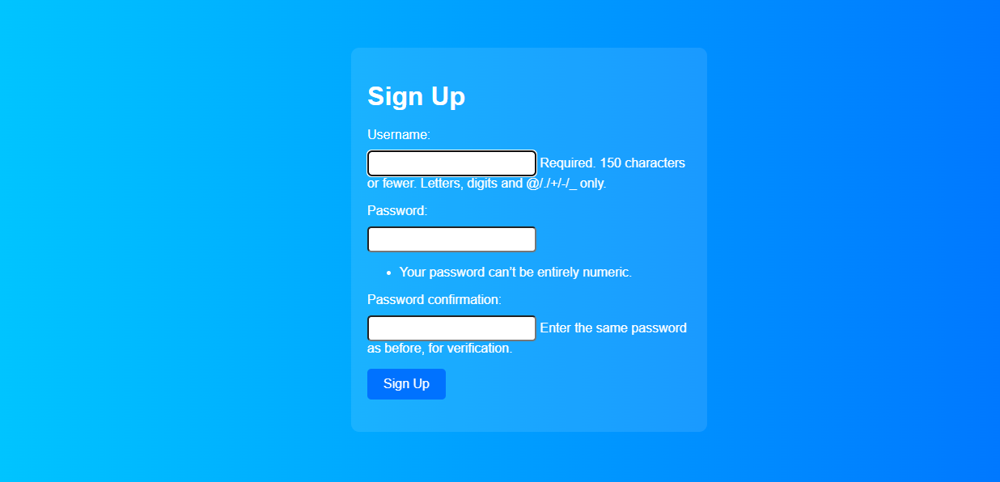

# Flight Booking System

This is a web application built using Django for flight ticket booking. It allows users to search for flights based on date and time, book tickets, view their bookings, and provides admin functionalities such as adding and removing flights.

## Features

- User authentication: Users can sign up and log in to the system.
- Flight search: Users can search for available flights based on date and time.
- Ticket booking: Users can book tickets for a selected flight, subject to availability.

## Tech Stack

The Flight Booking System uses the following technologies:

## Test Data
#### Admin
###### ID - admin
###### Password - admin

The Flight Booking System uses the following technologies:

- Backend: Django
- Database: PostgreSQL
- Frontend: HTML, CSS, JavaScript
